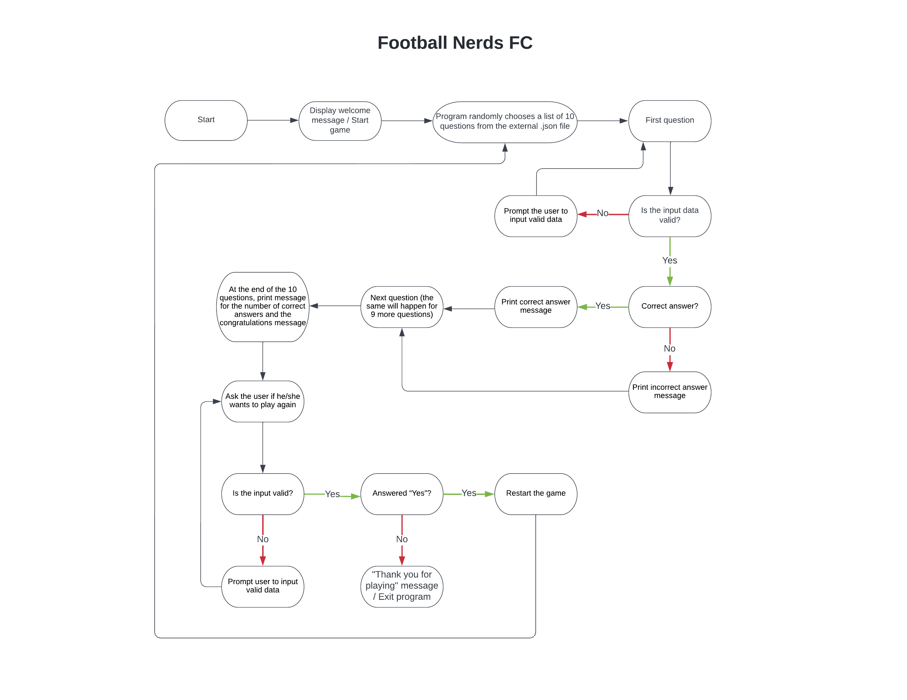

# Football Nerds FC
[View the live project here.](https://football-nerds-fc.herokuapp.com/)

Football Nerds FC is a Python command-line/terminal game, which runs on Heroku.

It’s a multiple choice football quiz – the user has to try and answer ten football-related questions randomly picked by the app, with the final score being presented to the user at the end. There are three answers for each question (1, 2 and 3), but only one is correct. Find out if you have what it takes to be the football nerd of the day!

## User Experience (UX)
### User stories
#### o	First-time Visitor Goals

**a.**	As a first-time user, I want to easily understand the main purpose of the game and how to play it.

**b.**	As a first-time user, I want to navigate through the game with ease without encountering any error messages or getting stuck.

**c.**	As a first-time user, I want to be able to test my football knowledge and answer correctly to as many questions as possible.

#### o	Returning Visitor Goals

**a.**	As a returning user, I want to play again and try and answer different football questions to further test my football knowledge.

#### o	Frequent User Goals

**a.**	As a frequent user, I want to play again and again to try and answer all the football questions of this game to fully test my football knowledge.

## Flowchart

In order to better visualize the steps required to build and play this game, I created a flowchart using Lucidchart, which allowed me to go through each part step-by-step and to understand what objects, features and functionalities were necessary and how to code them based on the user’s potential needs while using the app at every step of the way.

## Features

•	It works on all device sizes, but it's not responsive on all device sizes: it's a Python command-line app built using Python alone, so no HTML, CSS (media queries would have been used if it was a website, for example) or JavaScript were used, which is why it may not be fully responsive in smaller devices (tablets, smartphones, etc.).

**•	Welcome Message**

o	It welcomes the user to the game, explains its nature and challenges the user to play and be a true football nerd.

[Screenshot of the welcome message here](assets/docs/welcome-message-screenshot.png)

**•	Questions**

o	A list of 80 questions was created for this game, and the app randomly picks 10 as a sample of questions to be asked to the user every time a new game starts. The user is provided with 3 potential answers for each question, but only one is correct, and it's up to the user to guess the correct one. When the user gets it right, a "correct" message comes up informing the user that he/she got it right:

[Screenshot of the message when the user chooses the correct answer](assets/docs/question-answered-correctly-screenshot.png)

o	When the user gets it wrong, an "incorrect" message comes up informing the user that he/she got it wrong:

[Screenshot of the message when the user chooses the incorrect answer](assets/docs/question-answered-incorrectly-screenshot.png)

**•	Input Validation and Error-handling During the Game**

o	If the user inputs invalid data (any other input other than "1", "2" or "3"), an "invalid data" message comes up informing the user that he/she inputted invalid data and prompting him/her to re-enter valid data (he/she cannot proceed from the current question until valid data is inputted):

[Screenshot of the message when invalid data is inputted – Questions – example 1](assets/docs/example-of-invalid-user-input-and-validation-screenshot-1.png)

[Screenshot of the message when invalid data is inputted – Questions – example 2](assets/docs/example-of-invalid-user-input-and-validation-screenshot-2.png)

[Screenshot of the message when invalid data is inputted – Questions – example 3](assets/docs/example-of-invalid-user-input-and-validation-screenshot-3.png)

[Screenshot of the message when invalid data is inputted – Questions – example 4](assets/docs/example-of-invalid-user-input-and-validation-screenshot-4.png)

**•	Final Result and Congratulations Message**

o	When the user answers the last of the 10 questions, a message with the result (for example, 4/10 answers correct) is displayed to tell the user how he/she did, followed by a message congratulating him/her:

[Screenshot of the message with the final result and the congratulations message](assets/docs/final-result-and-congratulations-message-screenshot.png)

**•	Play Again Option**

o	At the same time as the final result and congratulations message, a message giving the user the option to play again is displayed – if the answer is "y" (yes), the app will choose another random sample of 10 questions and the game restarts with the first of those 10 questions:

[Screenshot of the message when the user chooses to play again](assets/docs/play-again-yes-screenshot.png)

o	If the answer is "n" (no), a "thank you for playing" message is displayed and the game is over:

[Screenshot of the message when the user chooses not to play again](assets/docs/play-again-no-screenshot.png)

**•	Input Validation and Error-handling for the Play Again Option**

o	If the user inputs invalid data (any other input other than "y" or "n"), an "invalid data" message comes up informing the user that he/she inputted invalid data and prompting him/her to re-enter valid data (he/she cannot proceed from the play again option until valid data is inputted):

[Screenshot of the message when invalid data is inputted – Play Again Option – example 1](assets/docs/example-of-invalid-user-input-and-validation-screenshot-5.png)

[Screenshot of the message when invalid data is inputted – Play Again Option – example 2](assets/docs/example-of-invalid-user-input-and-validation-screenshot-6.png)

[Screenshot of the message when invalid data is inputted – Play Again Option – example 3](assets/docs/example-of-invalid-user-input-and-validation-screenshot-7.png)

[Screenshot of the message when invalid data is inputted – Play Again Option – example 4](assets/docs/example-of-invalid-user-input-and-validation-screenshot-8.png)

### Features Left to Implement

•	Username input

•	Showing the correct answer when the user gets the answer wrong

•	A scoreboard/leaderboard with the highest scores ever to be shown at the end of each game

## Data Model

Not all things can be represented using, for example, strings, numbers or Booleans. Some things cannot be covered by the data types available in Python (or in any other language), which is why we should use classes and objects to create our own data types whenever necessary. I wanted to use Object-Oriented Programming (OOP) for this simple football quiz, so I created a class called "FootballQuizQuestion", which stores all the attributes a football question should have – it's a template for what a football question should be. This class contains an Initialize function, to map out all the attributes of a football question. In this case, it stores the question's prompt and the answer (its attributes), all the information we need to create the many question objects to be used by this app. When the game is first ran, a football question prompt is retrieved from a .json file, and this prompt is then passed as a parameter when creating the question object. The user is then prompted for his/her first answer, which will be validated/handled accordingly, and the game runs its course. This data model seemed appropriate for this kind of game.

## Technologies Used

### Languages Used

•	[Python](https://en.wikipedia.org/wiki/Python_(programming_language))

### Frameworks, Libraries & Programs Used

1.	[random Python package](https://docs.python.org/3/library/random.html):
o	Python's built-in random package was imported so the sample method could be used to retrieve a sample of ten questions from a .json file every time a new game starts.
2.	Snipping tool:
o	A snipping tool was used to create all the screenshots on this README.md file.	
3.	[Git](https://git-scm.com/):
o	Git was used for version control by utilizing the Gitpod terminal to commit to Git and push to GitHub.
4.	[GitHub](https://github.com/):
o	GitHub is used to store the project's code after being pushed from Git.
5.	[Heroku](https://dashboard.heroku.com/apps):
o	Heroku was used to deploy the live project.
6.	[Lucidchart](https://lucid.app/documents#/dashboard?folder_id=home):
o	Lucidchart was used to create the flowchart during the design process.

## Testing

PEP8 Online Checker was used to validate all the code on the Python file for this project to ensure there were no syntax errors.
•	PEP8 Online Checker - [Results](assets/docs/pep8-online-results.png)

The [Am I Responsive?](https://ui.dev/amiresponsive) website design tester was used to test the responsiveness of this website (though, as mentioned on the "Features" section of this README.md file, this app works on all device sizes, but it's not responsive on all device sizes – it's a Python command-line app built using Python alone, so no HTML, CSS [media queries would have been used if it was a website, for example] or JavaScript were used, which is why it may not be fully responsive in smaller devices [tablets, smartphones, etc.]). [Screenshot here](assets/docs/am-i-responsive-results.png)

### Testing User Stories from the User Experience (UX) Section

#### o	First-time Visitor Goals

**i.**	As a first-time user, I want to easily understand the main purpose of the game and how to play it.

a.	Upon entering the site, users are automatically greeted with a clean and easily readable message explaining what the game is about and with the first of ten questions. The call-to-action is obvious: read the question, read the options ("1", "2" and "3") and choose the correct one, which will take the user to the next question. The many friends and family members who tested this app found it very simple to understand.

**ii.** As a first-time user, I want to navigate through the game with ease without encountering any error messages or getting stuck.

a.	All the features of the game were thoroughly tested, including all the inputs and error-handling functionalities, and no error messages were found. All user feedback mentions that the game was easy to play and no error messages were ever displayed.

**iii.**    As a first-time user, I want to be able to test my football knowledge and answer correctly to as many questions as possible.

a.	All users who tested the game found the questions challenging and a true test to any football fan. Many also mentioned that they've learned a bit about football while playing it.

#### o	Returning Visitor Goals

**i.**	As a returning user, I want to play again and try and answer different football questions to further test my football knowledge.

a.	All returning users mentioned that they played this game endless times, and the fact that the program randomly chooses different questions every time a new game begins makes it exciting to play and a good source of football knowledge.

#### o	Frequent User Goals

**i.**	As a frequent user, I want to play again and again to try and answer all the football questions of this game to fully test my football knowledge.

a.	Most users who tested this app mentioned that they've been playing with it almost every day and competing with other friends and family members. This is good feedback, as they still report that no errors or issues were found and that they're still learning from this app.

### Further Testing

•	The app was tested on the Google Chrome, Mozilla Firefox and Microsoft Edge browsers. It was not tested on Internet Explorer as it's no longer supported.

•	It was viewed on a variety of devices such as large laptops, medium/smaller laptops, tablets, phablets and mobile phones. As mentioned before, this app works on all device sizes, but it's not responsive on all device sizes – it's a Python command-line app built using Python alone, so no HTML, CSS [media queries would have been used if it was a website, for example] or JavaScript were used, which is why it's fully functional, but it may not be fully responsive in smaller devices [tablets, smartphones, etc.]).

•	A large amount of testing was done to ensure that no errors happened when running the code and no error messages were ever displayed to the user. At no point in the game is the user stuck in a part of the program where he/she cannot move from (any invalid data inputted by the user is correctly handled, and he/she are advised on how to proceed by providing the necessary valid data).

•	All testing was completed in Gitpod and also in the Heroku terminal.

•	Friends, family members and football fans were asked to review the app and documentation to point out any bugs and/or user experience issues.

## Known Bugs

### Fixed Bugs

•	All answers were coming up as incorrect. This was due to the user's inputs being seen by the app as strings. Converting the user's inputs into integers fixed this.

•	Then, any integer would be accepted, and anything that was not an integer would throw an error. An if statement with a range to validate the user's input (wrapping the now nested if statement that checks if the answer is right and increments the score by 1) was added to fix it.

•	But the player was allowed to continue playing if an invalid integer was entered, which shouldn't happen (he/she should stay stuck on the same question until a valid input was provided), and any other input type other than an integer would still throw an error. A while loop with try/except validation was added to look for and handle input errors.

•	The app wasn't accepting answer "3" as a valid answer. This was because the range in the if statement was set between "1" and "3" (the range stops before the last number in it, only considering the second last number), so the range was reset between "1" and "4" and this resolved the issue.

•	In the option to play again, it was asking the same questions of the previous 10-question sample. This was fixed by placing the previously used sample variable inside the play-again if statement.

•	In the option to play again, it was not accepting uppercase "Y" or uppercase "N" as valid input. A lower method was added to the string input conversion to resolve the issue.

### Unfixed Bugs

•	No known bugs are believed to exist on this app.

## Deployment

GitHub is not built to handle backend languages like Python, so I used Heroku to deploy this project (all code was pushed to GitHub as normal, but the app was deployed using Heroku). There was no need to use "pip3 freeze > requirements.txt" to add any dependencies to the requirements.txt file before deployment as only the built-in Random package was imported (so the sample method could be used – no external libraries were used on this project). The project was deployed using the following steps...

1.	Create an account in [Heroku](https://dashboard.heroku.com/apps) and log in.
2.	On Heroku's dashboard, click on "Create New App".
3.	Enter a unique app name.
4.	Select your region.
5.	Click on "Create App".
6.	Click on the "Settings" tab, scroll down and click on "Reveal Config Vars".
7.	Enter "PORT" into the "Key" field and "8000" into the "Value" field and click on "Add" (no credentials were used, so no need for a creds.json file or to add any credentials).
8.	Scroll down to the buildpack section, click on "Add buildpack", select "python" and click on "Save changes".
9.	Repeat the last step to add "nodejs". The buildpacks must be in this order. Drag them to move them into the correct order if not.
10.	Due to a security issue, Heroku has disabled automated deployments from GitHub, and there's no indication if or when they will reactivate this, so the deployment process from this moment on had to be changed. In order to deploy my project while this situation persists, deployment had to be done from the project's Gitpod workspace following the next four steps.
11.	On the project's terminal/workspace on Gitpod, enter "heroku login -i".
12.	Enter the email address and the password previously set up on Heroku when the account was created.
13.	Enter "heroku git:remote -a" followed by the project's name on Heroku (in this case, "heroku git:remote -a football-nerds-fc").
14.	Enter "git push heroku main".
15.	To view the deployed app, go back to Heroku's dashboard, click on the app's name on the list of apps and click on "Open app".

## Credits

### Code

•	The idea to build a multiple choice quiz came from [Mike Dane's Giraffe Academy Python tutorial](https://www.youtube.com/watch?v=rfscVS0vtbw), at 3:57:36. The whole tutorial is, in my opinion, the best Python tutorial for beginners that can be found online, and I've learned much while watching it. It was crucial for me to understand some of the Python's concepts used on this app, and some of my code was based on Mike's code on this tutorial, though most of it got significantly transformed as I coded this app in order to meet my specific ideas and the project's requirements.

•	The W3Schools Online Web Tutorials were a huge help throughout the creation of this app – some of them were extensively used as a source of code knowledge/confirmation. A good example of this was the tutorial about [Python JSON](https://www.w3schools.com/python/python_json.asp), which allowed me to use Python's built-in JSON package to work with JSON data (to import the .json file with the question prompts – my mentor's guidance was also particularly important here).

•	Stack Overflow was also used as a source of knowledge and code. For example, I complemented Mike Dane's multiple choice quiz idea with [this page on Stack Overflow](https://stackoverflow.com/questions/26792705/how-to-create-a-simple-quiz-in-python-with-multiple-topics). [This page on Stack Overflow](https://stackoverflow.com/questions/44306681/adding-validation-to-answer-in-quiz-gives-wrong-answers) also helped with the issues I was having with validation. And I also found out about the Random shuffle method (used in the earlier stages of the coding process) on [this page on Stack Overflow](https://stackoverflow.com/questions/30970070/how-to-randomize-order-of-questions-in-a-quiz-in-python), which was later replaced by the Random sample method I found on [this page on Stack Overflow](https://stackoverflow.com/questions/22741319/what-does-the-random-sample-method-in-python-do).

### Content

•	All football questions were taken from [this page](https://www.goal.com/en/news/best-football-quiz-questions-trivia-answers/1dfwcyp3388zg1lon8wlit8q42) on the [Goal website](https://www.goal.com/en-ie).

### Acknowledgements

•	My Mentor for continuous helpful feedback.

•	Tutor support at Code Institute for their support.

•	[Code Institute](https://codeinstitute.net/ie/)'s Slack community for their support.

•	All family members, friends and football fans who helped testing this app.